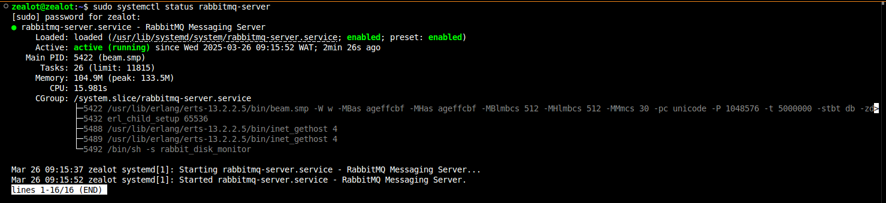
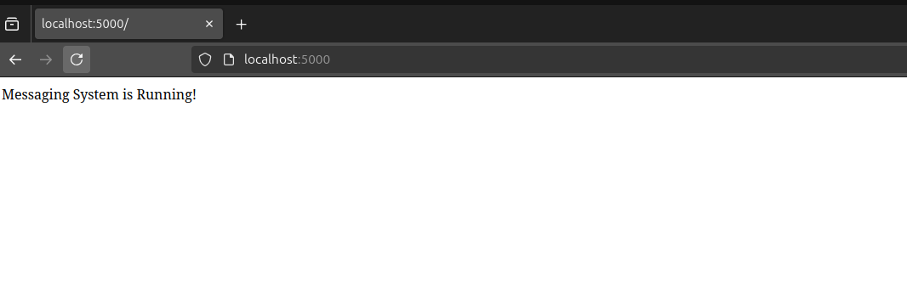
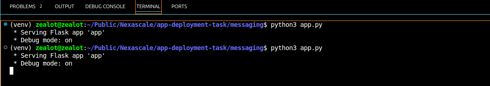
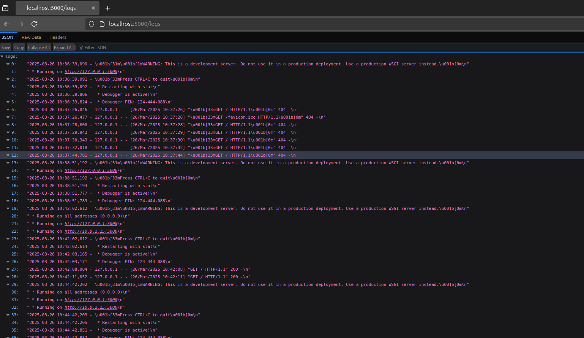
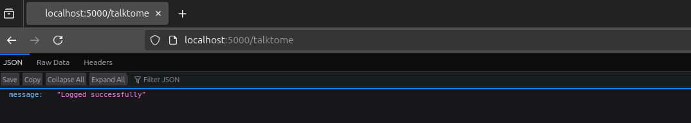
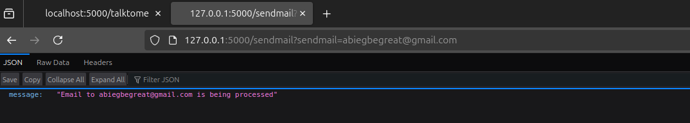
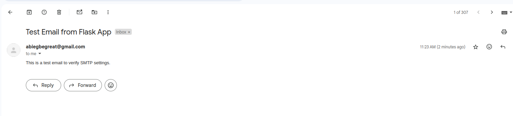
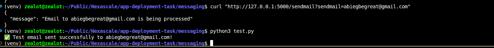

## Installing Dependecies
```sh
sudo apt install -y  nginx rabbitmq-server
```
**Note:** If you don’t have Python and a virtual environment installed, use the command below:
```sh
sudo apt update && sudo apt upgrade -y
sudo apt install -y python3 python3-pip python3-venv nginx rabbitmq-server
```
- `**python3-venv**`: Allows us to create an isolated Python environment for dependencies.
- `**nginx**`:  Acts as a reverse proxy for the Python app.
- `**rabbitmq-server**`: Handles Celery message queueing.

## Set Up RabbitMQ & Celery

Start and enable RabbitMQ:
```sh
sudo systemctl start rabbitmq-server
sudo systemctl enable rabbitmq-server
```
Enable the RabbitMQ management plugin (for monitoring queues)
```sh
sudo rabbitmq-plugins enable rabbitmq_management
sudo systemctl restart rabbitmq-server
```
Check RabbitMQ  if is running
```sh 
sudo systemctl status rabbitmq-server
```
If it's running correctly, you'll see Active: active (running). As shown in the image below


## Create the Python Application

1.  Create a python virtual environment
```sh
python3 -m venv venv
source venv/bin/activate
```
2.  Install required Python packages
```sh
pip install flask celery eventlet pika 
```

## Configuring task.py with Email App Password
To securely send emails without storing your password in the code, Google App Passwords are used. This allows the app to authenticate with Gmail without exposing your real password.

### Generate an App Password
1. Go to Google App Passwords.
2. Select Mail as the app and Other (Custom name) for the device.
3. Generate the password and save it.

This is the password you would use when setting the mail password as an enviroment varibale.

## Configuring task.py
Before running the app, set up environment variables for email credentials:
```sh
export EMAIL_HOST_USER="your-email@example.com"
export EMAIL_HOST_PASSWORD="your-secure-password"
export EMAIL_RECIPIENT="recipient-mail@example.com"
```

## Running the Application
After setup, you can start the Flask app and Celery worker
```sh
# Start the Flask application
python3 app.py

# Start the Celery worker
celery -A task worker --loglevel=info
```
Once running, you can test by sending a request:

```sh
curl "http://127.0.0.1:5000/sendmail?sendmail=mail@example.com"
```
If successful, you should see:
```sh
{
  "message": "Email to mail@example.com is being processed"
}
```

## Screenshots









