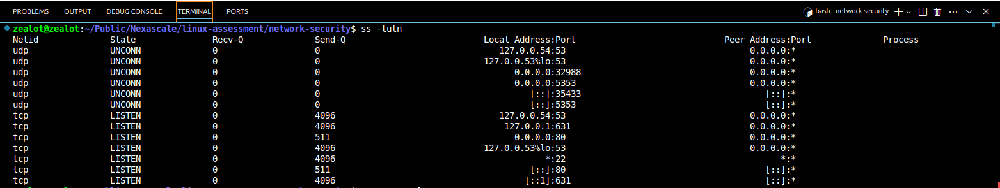
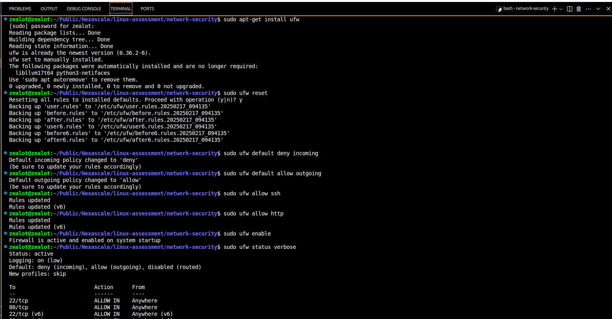
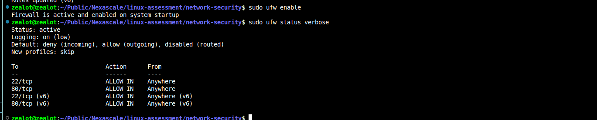
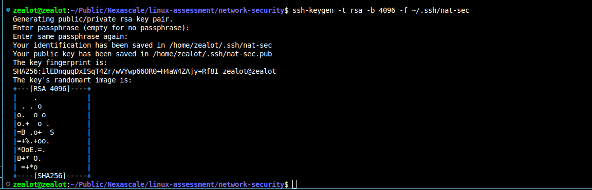

# Linux Server Security Configuration
## Overview
This guide details the essential steps for securing a Linux server according to HypotheticalCorp's security requirements. The configuration includes firewall setup, port management, and SSH hardening.

The aim of the scripts in this directory was to answer the question below;
> **Networking and Security**  
> Security is a **top priority** at HypotheticalCorp. Your company policy requires:  
> **Your tasks are to configure these security measures on your Linux server?**    
>    - Blocking all incoming traffic except SSH and HTTP.
>    - Checking which ports are currently open on the system.
>    -  Setting up an SSH key-based authentication to eliminate password logins.

## Port Scanning
### Checking Open Ports
To identify currently open ports on your system:
```sh
# Using ss command
ss -tuln
```
The output will show all active listening ports and their associated services.

## Firewall Configuration
### Setting Up UFW (Uncomplicated Firewall)
1. Install UFW:
```sh
sudo apt-get install ufw
```
2. Configure default policies:
```sh
sudo ufw reset
sudo ufw default deny incoming
sudo ufw default allow outgoing
```
3. Allow required services
```sh
sudo ufw allow ssh    # Port 22
sudo ufw allow http   # Port 80
```
4. Enable and verify firewall:
```sh
sudo ufw enable
sudo ufw status verbose
```

## SSH Key Authentication
### Setting Up Key-Based Authentication
1. Generate SSH key pair (on local machine):
```sh
ssh-keygen -t rsa -b 4096 -f ~/.ssh/nat-sec
```
This command generates an ssh-key with the name **nat-sec** and stores it within the default ssh directory. 

2. Transfer public key to server:
```sh
ssh-copy-id username@server_ip
```
3. Configure SSH daemon (on server):
Edit `/etc/ssh/sshd_config` with the following settings:
```sh
PasswordAuthentication no
PubkeyAuthentication yes
ChallengeResponseAuthentication no
```
4. Restart SSH service:
```sh
sudo systemctl restart sshd
```
5. Keep the system updated:
```sh
sudo apt update && sudo apt upgrade
```





