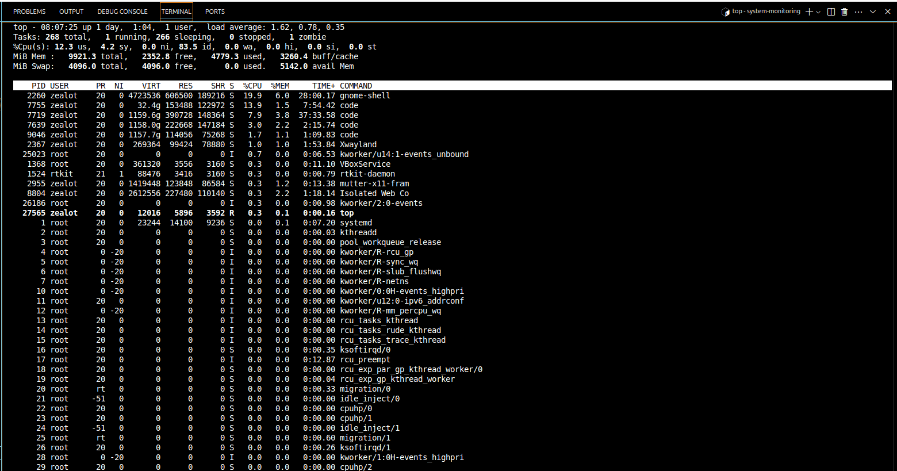
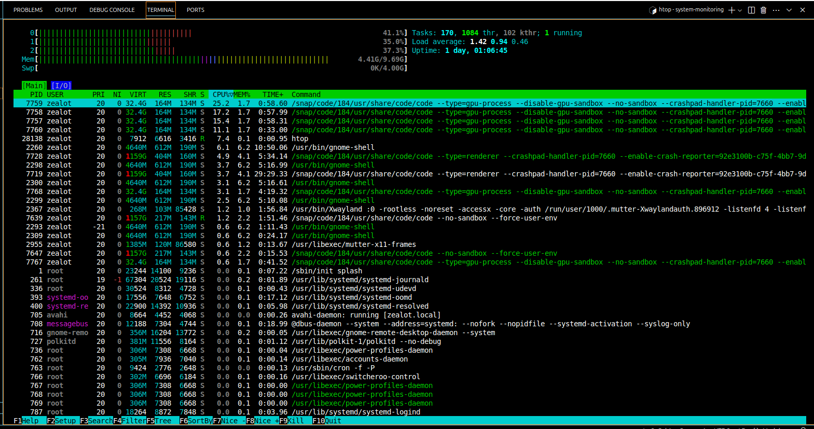
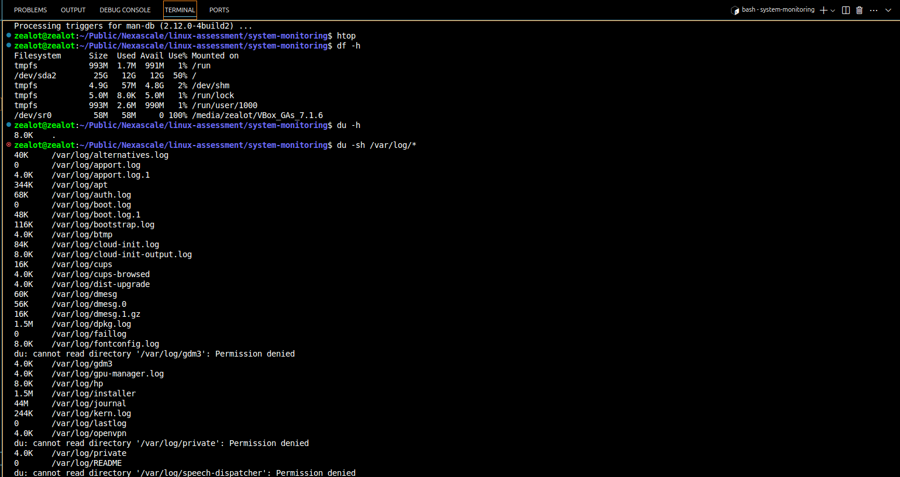
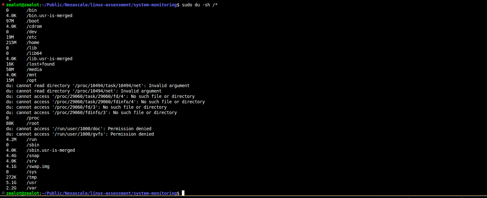
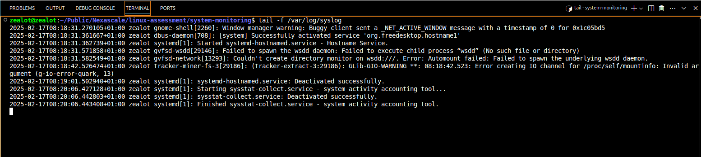
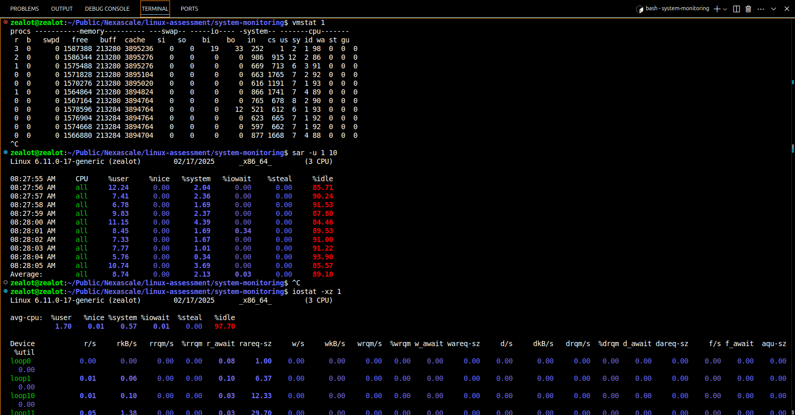

#  System Monitoring & Performance Analysis
Initnially, whenyou want to troubleshoot, system resource usuage and performance, the first thing to do should be to check how the system is using available resources in real time. 

### Resource Analysis
This commands below give you real-time visibility into system resource usage. `htop` provides a more user-friendly interface with color coding and the ability to scroll.
```sh
# Check top processes using resources
top

# For a more user-friendly view, install htop
sudo apt install htop
htop
```



### Disk Usage Analysis
Start with overall disk usage, then drill down to specific directories. 
```sh
# Check disk usage
df -h

# Check directory sizes in /var/log
du -sh /var/log/*

# Monitor logs in real-time
tail -f /var/log/syslog


# Find large files/directories
du -sh /*
du -sh /var/log/*
```



### Log Analysis
This commands provides real-time log monitoring helps identify immediate issues. Looking for error patterns can reveal recurring problems.
```sh
# Monitor system logs in real-time
tail -f /var/log/syslog
tail -f /var/log/messages
```

