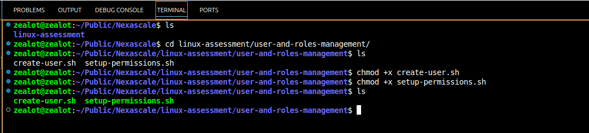
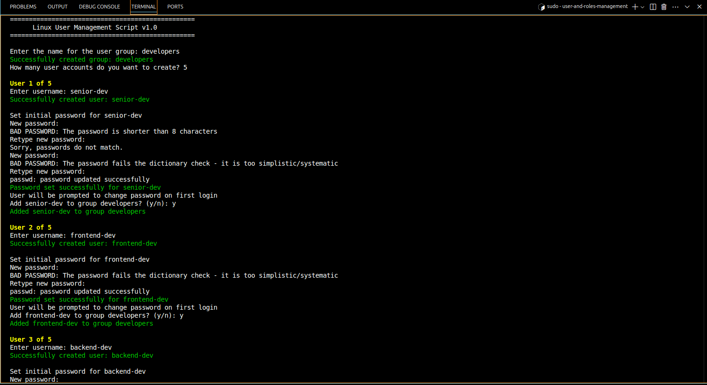
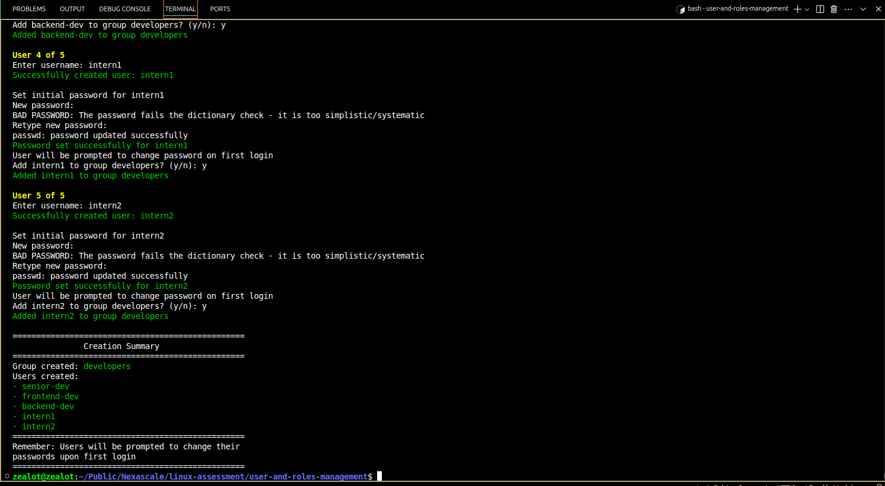

# Linux User and Role Management Setup Guide
This documentation covers the implementation of user management, permissions, and SSH access control for a development team environment.

The aim of the scripts in this directory was to answer the question below;

> Your company recently hired five new developers who need access to the development server. Your task is to:
> - Create user accounts for them and add them to the developers group.
> - Ensure they have read and execute permissions for /var/www/project but cannot modify files.
> - Restrict SSH access for two of them, who should only log in locally.

## Prerequisites
1. Linux system with sudo privileges
2. Bash shell

## Part 1: User Account Creation (create_user.sh)
The `create_users.sh` script automates the creation of user accounts and groups.

### How to Run
```sh
# Make the script executable and then run it
chmod +x create_users.sh
sudo ./create_users.sh
```
**The sudo is added before running the scripts because some of the configurations within the script require sudo privileges.**

### What the Script Does
1. When you run the scripts, the first thing is does is to creates a developers group
2. Then it prompts for number of users to be created. 
3. Creates each user account with:
    - Home directory
    - Bash shell
    - Initial password that must be changed on first login

4. Option to add users to developers group

### Explanation of the create-user.sh Script
The scripts with a declaration that this as a bash script and defines color codes that will be used to make output messages more visible (red for errors, green for success, etc.).
```sh
#!/bin/bash
# Color codes for better visibility
RED='\033[0;31m'
GREEN='\033[0;32m'
YELLOW='\033[1;33m'
NC='\033[0m' # No Color
```
These are two utility functions. The first checks if input is empty and shows an error if it is. The second checks if a user already exists in the system.
```sh
validate_input() {
    local input=$1
    local message=$2
    if [[ -z "$input" ]]; then
        echo -e "${RED}Error: $message${NC}"
        return 1
    fi
    return 0
}

user_exists() {
    id "$1" &>/dev/null
    return $?
}
```
This is the start of the user creation function. It first checks if the user exists, and if not, creates them with a home directory and bash shell.
```sh
create_user() {
    local username=$1
    
    if user_exists "$username"; then
        echo -e "${YELLOW}Warning: User $username already exists. Skipping creation.${NC}"
        return 1
    fi

    # Create user with home directory and bash shell
    if useradd -m -s /bin/bash "$username"; then
        echo -e "${GREEN}Successfully created user: $username${NC}"
```
This section handles password setup for the new user. It sets an initial password and forces it to be changed on first login.
```sh
# Prompt for password
        echo -e "\nSet initial password for $username"
        if passwd "$username"; then
            # Force password change on first login
            chage -d 0 "$username"
            echo -e "${GREEN}Password set successfully for $username${NC}"
            echo "User will be prompted to change password on first login"
            return 0
        else
            echo -e "${RED}Failed to set password for $username${NC}"
            return 1
        fi
    else
        echo -e "${RED}Failed to create user: $username${NC}"
        return 1
    fi
}
```
This displays the script header and gets the group name from the user, making sure it's not empty.
```sh
# Script header
clear
echo "================================================="
echo "      Linux User Management Script v1.0"
echo "================================================="
echo

# Create user group
read -p "Enter the name for the user group: " group_name

# Validate group name
while ! validate_input "$group_name" "Group name cannot be empty"; do
    read -p "Enter the name for the user group: " group_name
done
```
This section checks if the group exists and creates it if it doesn't.
```sh
# Create group
if ! getent group "$group_name" > /dev/null; then
    if groupadd "$group_name"; then
        echo -e "${GREEN}Successfully created group: $group_name${NC}"
    else
        echo -e "${RED}Failed to create group. Exiting...${NC}"
        exit 1
    fi
else
    echo -e "${YELLOW}Group $group_name already exists${NC}"
fi
```
This gets and validates the number of users to create, ensuring it's a positive number.
```sh
# Get number of users to create
read -p "How many user accounts do you want to create? " num_users

# Validate number input
while ! [[ "$num_users" =~ ^[0-9]+$ ]] || [ "$num_users" -lt 1 ]; do
    echo -e "${RED}Please enter a valid number greater than 0${NC}"
    read -p "How many user accounts do you want to create? " num_users
done
```
This starts the user creation loop, getting and validating each username.
```sh
# Create users
created_users=()
for ((i=1; i<=num_users; i++)); do
    echo -e "\n${YELLOW}User $i of $num_users${NC}"
    read -p "Enter username: " username
    
    # Validate username
    while ! validate_input "$username" "Username cannot be empty"; do
        read -p "Enter username: " username
    done
```
This creates each user and optionally adds them to the specified group.
```sh
if create_user "$username"; then
        created_users+=("$username")
        
        # Ask to add user to group
        read -p "Add $username to group $group_name? (y/n): " add_to_group
        case $add_to_group in
            [Yy]*)
                if usermod -aG "$group_name" "$username"; then
                    echo -e "${GREEN}Added $username to group $group_name${NC}"
                else
                    echo -e "${RED}Failed to add $username to group $group_name${NC}"
                fi
                ;;
            *)
                echo "Skipped adding $username to group $group_name"
                ;;
        esac
    fi
done
```
This final section prints a summary of all actions taken - which group was created and which users were added.
```sh
# Summary
echo -e "\n================================================="
echo "               Creation Summary"
echo "================================================="
echo -e "Group created: ${GREEN}$group_name${NC}"
echo "Users created:"
for user in "${created_users[@]}"; do
    echo -e "${GREEN}- $user${NC}"
done
echo "================================================="
echo "Remember: Users will be prompted to change their"
echo "passwords upon first login"
echo "================================================="
```
### Screenshots of create-user.sh scripting being executed. 




## Part 2: Permission and SSH Setup
The process of setting permissions for users and restricting access to the SSH directroy can be done using either manual approach or it can be done using a script. To carry it out manually this are the required steps explained below;

**1. Setting Up Project Directory**
```sh
# Create project directory
sudo mkdir -p /var/www/project

# Set ownership
sudo chown root:developers /var/www/project

# Set permissions (read & execute for group)
sudo chmod 755 /var/www/project
```
**2. Restricting SSH Access**
```sh
# Edit SSH config
sudo nano /etc/ssh/sshd_config

# Add restriction for interns
DenyUsers intern1 intern2

# Restart SSH service
sudo systemctl restart ssh
```

## Common Challenges Encountered While Running The Script
1. Permission denied" when running script
    - Solution: Run with sudo

2. SSH service not found
    - Solution: Install SSH server

```sh
sudo apt update
sudo apt install openssh-server
# Verify it is running
sudo systemctl status ssh
```

