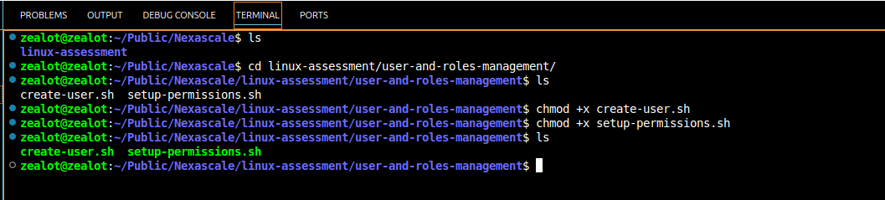
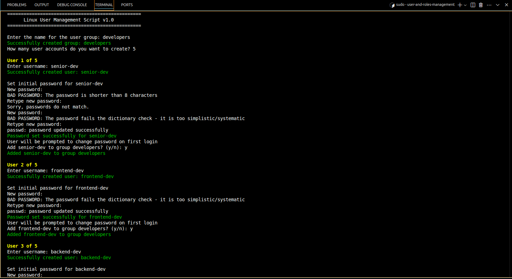
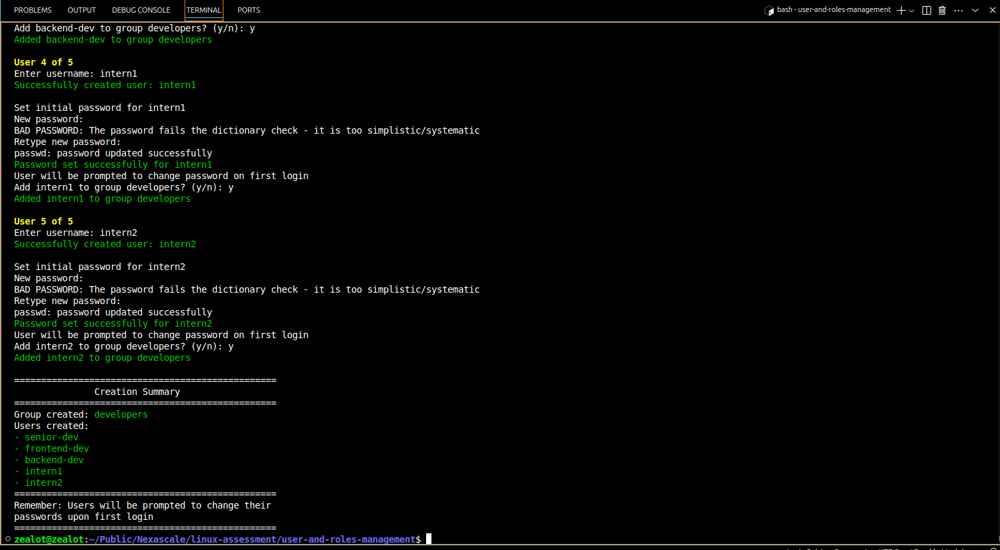

# Linux User and Role Management Setup Guide
This documentation covers the implementation of user management, permissions, and SSH access control for a development team environment.

The aim of the scripts in this directory was to answer the question below;

> Your company recently hired five new developers who need access to the development server. Your task is to:
> - Create user accounts for them and add them to the developers group.
> - Ensure they have read and execute permissions for /var/www/project but cannot modify files.
> - Restrict SSH access for two of them, who should only log in locally.

## Prerequisites
1. Linux system with sudo privileges
2. Bash shell

## Part 1: User Account Creation (create_user.sh)
The `create_users.sh` script automates the creation of user accounts and groups.

### How to Run
```sh
# Make the script executable and then run it
chmod +x create_users.sh
sudo ./create_users.sh
```
**The sudo is added before running the scripts because some of the configurations within the script require sudo privileges.**

### What the Script Does
1. When you run the scripts, the first thing is does is to creates a developers group
2. Then it prompts for number of users to be created. 
3. Creates each user account with:
    - Home directory
    - Bash shell
    - Initial password that must be changed on first login

4. Option to add users to developers group






