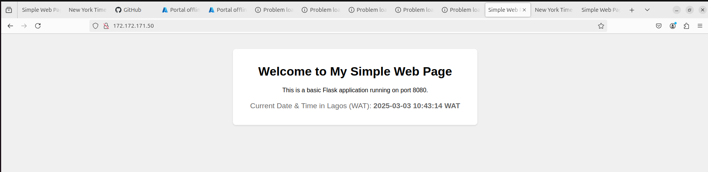
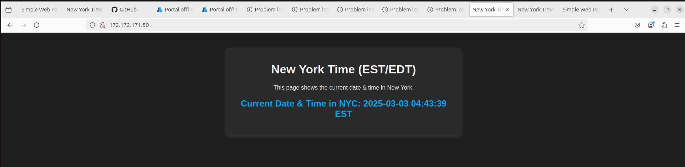

# Load Balanced Web Application Deployment on Azure

## Task Overview

The objective of this assessment is to set up and deploy a load-balanced web application on Microsoft Azure. The deployment involves provisioning virtual machines (VMs), configuring a load balancer, and ensuring seamless traffic distribution across two web servers. This setup is automated using Ansible to manage configurations efficiently.

## Expected Outcomes

Upon completion of this task, the following should be achieved:

- A load balancer distributing traffic to two web servers.
- A Flask-based web application running on both web servers.
- Automated deployment using Ansible.
- Secure and structured SSH access between all VMs.
- Verification that requests to the load balancer are evenly distributed.

## Implementation Steps
### 1. Provision Azure Virtual Machines

Create three virtual machines:
- Load Balancer VM (acts as the master node)
- Web Server 1
- Web Server 2

Commands to create the VMs:
```sh
az vm create --resource-group nexascale --name loadbalancer --image Ubuntu2204 --size Standard_B1s --admin-username azureuser --ssh-key-values ~/.ssh/nexascale_key.pub --public-ip-address loadbalancer-ip

az vm create --resource-group nexascale --name webserver1 --image Ubuntu2204 --size Standard_B1s --admin-username azureuser --ssh-key-values ~/.ssh/nexascale_key.pub --public-ip-address webserver1-ip

az vm create --resource-group nexascale --name webserver2 --image Ubuntu2204 --size Standard_B1s --admin-username azureuser --ssh-key-values ~/.ssh/nexascale_key.pub --public-ip-address webserver2-ip
```

### 2. Establish SSH Connectivity

Ensure the load balancer VM can securely communicate with both web servers:
```sh
scp -i ~/.ssh/nexascale_key ~/.ssh/nexascale_key azureuser@<loadbalancer-ip>:~/.ssh/
chmod 600 ~/.ssh/nexascale_key
```

### 3. Deploy Application with Ansible

Run the Ansible playbooks to set up the web servers and load balancer:
```sh
ansible-playbook playbooks/webserver.yml
ansible-playbook playbooks/deploy.yml
ansible-playbook playbooks/haproxy.yml
```

### 4. Configure Firewall Rules

Ensure inbound traffic is allowed on the necessary ports:
- **Web Server 1:** Port 8080
- **Web Server 2:** Port 8090
- **Load Balancer:** Port 80

### 5. Verify Load Balancing

To confirm that the load balancer is distributing traffic correctly:

- Access the application via the load balancer's IP: http://172.172.171.50
- Reload multiple times to check if requests are forwarded between both web servers.

### 6. Screenshots
Load balancer successfully distributing traffic.



### 7. Conclusion

This assessment task validates the ability to:
1. Deploy and configure Azure VMs.
2. Implement automated deployments using Ansible.
3. Set up a load-balanced architecture.
4. Troubleshoot and resolve common deployment issues.

This README serves as a guide to understanding and verifying the completion of the assessment task.
