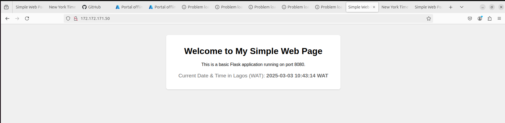

# Ansible Automation for Load Balancer Deployment on Azure

## 1. Establishing SSH Connection Between VMs
This is to ensure that the SSH key used in creating the VMs on Azure is available on the Load Balancer VM for secure remote access to the web servers. 

The Load balancer will server as the master VM, while the webserver 1 and 2 will be the slaves VM

```sh
# Copy your SSH key to the load balancer VM
scp -i ~/.ssh/nexascale_key ~/.ssh/nexascale_key azureuser@172.172.171.50:~/.ssh/

# Set proper permissions for the SSH key on the load balancer VM
chmod 600 ~/.ssh/nexascale_key

# Test SSH connection to the first web server
ssh -i ~/.ssh/nexascale_key azureuser@40.71.191.134

# Test SSH connection to the second web server
ssh -i ~/.ssh/nexascale_key azureuser@172.191.95.80
```
If SSH is successful, proceed with Ansible setup.


## 2. Ansible Configuration

### Step 1: Install Ansible on the Load Balancer Server
```sh
sudo apt update -y
sudo apt install ansible -y
ansible --version
```


### Step 2: Define Inventory File (inventory.ini)

Create an inventory file to manage target servers.
```sh
[webservers]
webserver1 ansible_host=40.71.191.134 ansible_user=azureuser ansible_ssh_private_key_file=~/.ssh/nexascale_key
webserver2 ansible_host=172.191.95.80 ansible_user=azureuser ansible_ssh_private_key_file=~/.ssh/nexascale_key

[loadbalancer]
loadbalancer ansible_host=172.172.171.50 ansible_user=azureuser ansible_ssh_private_key_file=~/.ssh/nexascale_key
```


### Step 3: Configuration Ssetup
Ensure that all the neccessary configuration for the file path are created as seen in the directory called [ansible](../ansible/)

### Step4: Running Ansible Playbooks
Once everything is set up, run the playbooks in the following order:
```sh
ansible-playbook playbooks/webserver.yml
ansible-playbook playbooks/deploy.yml
ansible-playbook playbooks/haproxy.yml
```


### Step 5: Testing the Setup
**Step 1: Verify Web Servers Are Running**
```sh
# Access through the terminal 
curl -I http://40.71.191.134:8080
curl -I http://172.191.95.80:8090
# Access through the browser
http://40.71.191.134:8080
http://172.191.95.80:8090

```
**Step 2: Test Load Balancer Routing**
```sh
curl -I http://172.172.171.50
```

## 3. Accessing VM For Verification
### Webserver 1
You can access this virtual machine through http://40.71.191.134:8080

### Webserver 2
You can access this virtual machine through http://172.191.95.80:8090


### Confirmation of Loadbalancing 
Checking and verifying loadbalancing can be done http://172.172.171.50



## 4. Challenges Faced and Resolutions

### 1. Requirements File Permission Issue

Initially, the requirements.txt file was meant to be created in /var/www/html/ using Ansible with become: true. However, despite granting elevated privileges, the file was not being created. To resolve this, I had to manually SSH from the load balancer into both web servers and create the file directly in the directory:
```sh
ssh -i ~/.ssh/nexascale_key azureuser@40.71.191.134
sudo touch /var/www/html/requirements.txt
sudo chown www-data:www-data /var/www/html/requirements.txt
exit

ssh -i ~/.ssh/nexascale_key azureuser@172.191.95.80
sudo touch /var/www/html/requirements.txt
sudo chown www-data:www-data /var/www/html/requirements.txt
exit
```

### 2. Flask Service Not Running on Startup

A major issue was that Flask did not start correctly as a service after deployment. Despite using Ansible to configure the service, it was not functioning properly. To resolve this, I manually created the systemd service file on each web server:
```sh
ssh -i ~/.ssh/nexascale_key azureuser@40.71.191.134
sudo nano /etc/systemd/system/flask1.service
```
The following content was added to ensure Flask started correctly:
```sh
[Unit]
Description=Gunicorn instance to serve Flask app
After=network.target

[Service]
User=www-data
Group=www-data
WorkingDirectory=/var/www/html
ExecStart=/usr/bin/python3 /var/www/html/app.py
Restart=always

[Install]
WantedBy=multi-user.target
```
After creating the service file, the following commands were run:
```sh
sudo systemctl daemon-reload
sudo systemctl enable flask1.service
sudo systemctl start flask1.service
sudo systemctl status flask1.service
```
### 3. Load Balancer Not Reaching Web Servers

Initially, HAProxy was not routing traffic correctly, and the logs indicated connection refusals. This was resolved by ensuring Flask was running on the correct ports (8080 for webserver1 and 8090 for webserver2). Additionally, I had to explicitly allow inbound traffic to these ports from the Azure portal:

- `Webserver 1:` Allowed inbound traffic on port 8080
- `Webserver 2:` Allowed inbound traffic on port 8090
- `Load Balancer:` Allowed inbound traffic on port 80 (HTTP) to forward requests to the web servers

### 4. Ansible Playbooks Not Applying Changes Properly

Some tasks in Ansible playbooks did not execute correctly due to incorrect paths or permissions. This was resolved by carefully structuring tasks, ensuring correct user privileges, and verifying each step using Ansible’s dry-run mode (--check).

