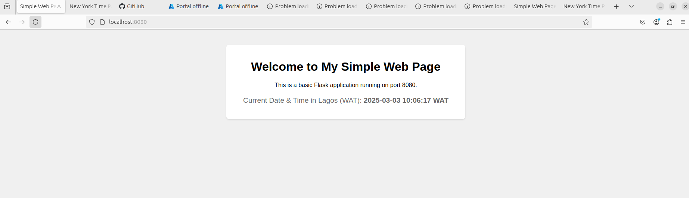
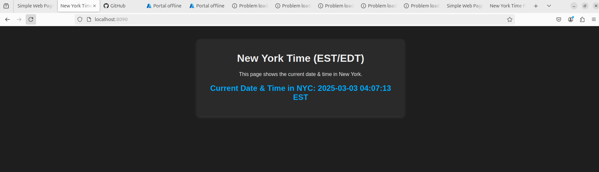

# TimeZone Web Application (Lagos & New York)

This project consists of two simple Flask applications that display the current time in Lagos (WAT) and New York (EST/EDT).

## Purpose
The goal of this project is to demonstrate the concept of load balancing by deploying these applications on different servers. Each server will serve users from different locations, ensuring efficient traffic distribution and improved availability.

### Files in the Project
- `app.py` → Displays the current time in **Lagos, Nigeria (WAT)**
- `us-app.py` → Displays the current time in **New York, USA (EST/EDT)**

Each file has its own color theme for easy differentiation:
1. **Lagos Version:** Light theme with warm colors 
2. **New York Version:** Dark theme with cool blue highlights

### How It Works
1. When you access the Lagos app (app.py), it will show the current date and time in WAT.
2. When you access the New York app (us-app.py), it will show the current date and time in EST/EDT.
3. These applications will later be deployed on separate servers, and a load balancer will distribute traffic between them.

### How to Run Locally
#### Step 1: Install Requirements
Ensure you have Python installed, then create a virtual environment and install the required packages:
```sh 
# Create a Virtual Environment
python3 -m venv venv
#  Activate the Virtual Environment
source venv/bin/activate
# Install Dependencies
pip install flask pytz
```
#### Step 2: Start the Lagos App
Run the Lagos application on **port 8080:**
```sh 
python app.py
```
Open http://localhost:8080 in your browser to see the Lagos time page.

#### Step 3: Start the New York App
Run the New York application on **port 8090:**
```sh
python us-app.py
```
Open http://localhost:8090 in your browser to see the New York time page.

